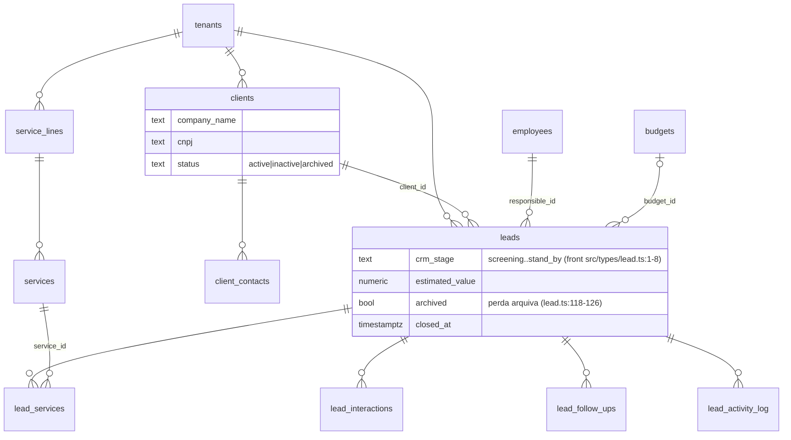
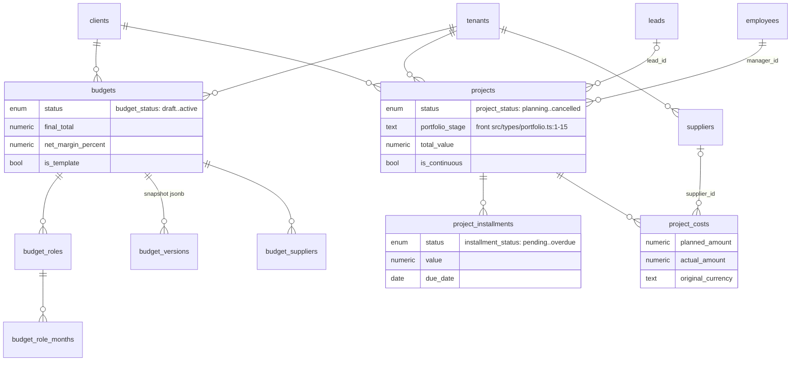
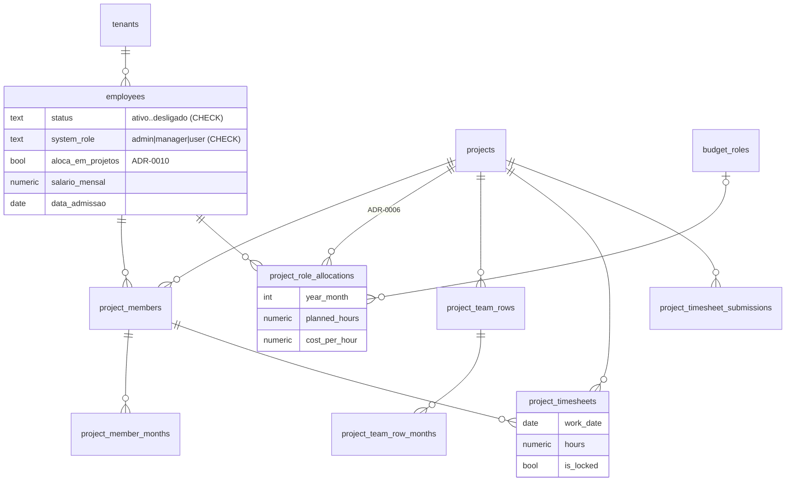
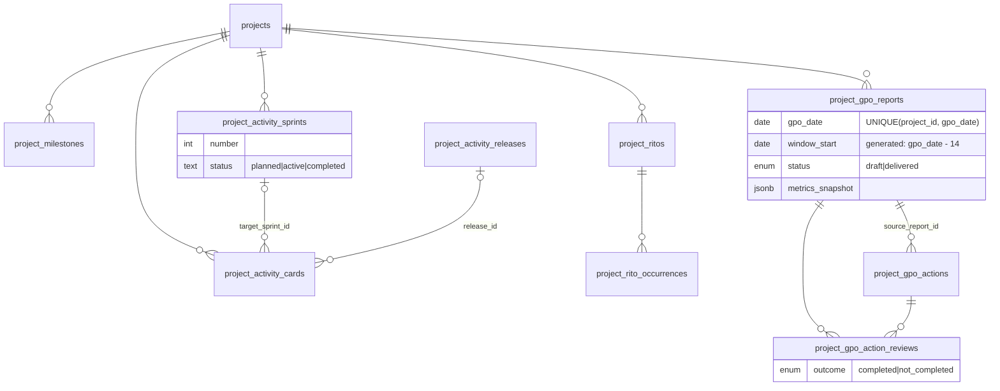
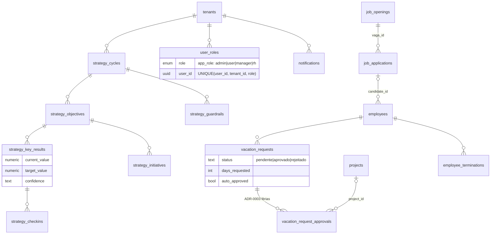

---
sources:
  - src/integrations/supabase/types.ts
  - supabase/migrations/20260121002930_945e9a92-8375-4b35-b9eb-291f57ae6716.sql
  - supabase/migrations/20260810190000_project_gpo_reports.sql
  - supabase/migrations/20260909120000_tenant_plan_and_signup_attempts.sql
  - supabase/migrations/20260909130000_tenant_plan_enforced_in_rls.sql
  - supabase/migrations/20260910100000_cost_centers.sql
  - supabase/migrations/20260910120000_cost_center_on_catalog_items.sql
  - src/types/lead.ts
  - src/types/portfolio.ts
---

# ERD — Entidades e Relações

> Derivado de `src/integrations/supabase/types.ts` (115 tabelas) + migrations
> mais recentes (total real ~118 tabelas). Aqui estão só as **entidades núcleo**
> (~32), agrupadas em clusters para legibilidade. FKs extraídas dos blocos
> `Relationships` do types.ts; linhas citadas são do types.ts salvo indicação.

## Multi-tenant

Isolamento por **coluna `tenant_id` + RLS** (não schema-per-tenant).
`public.tenants` e a função `user_belongs_to_tenant(_user_id, _tenant_id)`
nascem em `supabase/migrations/20260121002930_*.sql:5-10, 82-92` — o vínculo é
resolvido via `employees.auth_id = auth.uid()`. 69 tabelas têm `tenant_id`
direto; as demais são filhas que herdam o tenant pelo pai (ex.: `budget_roles`
via `budget_id`, `project_installments` via `project_id`). Nos diagramas,
`tenants` aparece só nas raízes para não virar estrela ilegível.

**Plano do tenant** (migration `20260909120000`, PUL-224): `tenants.plan` (`trial` | `active`),
`trial_ends_at`, `plan_changed_at`, `plan_changed_by`. Tenant novo nasce `trial` com 14 dias
(trigger `tenants_default_trial`); tenants anteriores à migration foram marcados `active`. As
colunas de plano só mudam por service role ou sessão direta no banco (trigger
`tenants_guard_plan_columns`); a policy de UPDATE por `configuracao:editar` vale para o resto.
O app lê `plan`/`trial_ends_at` em `AuthContext` e resolve dias restantes em `src/lib/tenantPlan.ts`.
Desde `20260909130000` (PUL-228, ADR-0028) `user_belongs_to_tenant` e `has_capability` exigem
`tenant_is_active()`: teste vencido nega toda leitura e escrita sob RLS; a leitura do próprio
`tenants` usa `user_is_member_of_tenant` (pertencimento puro) para o app mostrar o fim do teste.

## Cluster 1 — Comercial (Pipeline de Oportunidades)

Obs.: no banco as tabelas chamam-se `leads*` (nomenclatura histórica); na UI o
termo é **Oportunidade/Pipeline** (boundaries.md).

Fontes: `leads` L1919, `lead_services` L1861, `lead_interactions` L1790,
`lead_follow_ups` L1709, `clients` L775, `services` L5096, `service_lines` L4998.

`leads.crm_stage` é **text sem CHECK** — o contrato de valores vive no front
(`src/types/lead.ts:1-8`): `screening | qualification | proposal | negotiation
| closed | closed_lost | stand_by`.

## Cluster 2 — Orçamento → Projeto → Financeiro

Fontes: `budgets` L578, `budget_roles` L402, `budget_versions` L530,
`projects` L4582, `project_installments` L3559, `project_costs` L3357
(tabela unificada de custos — ADR-0003/0004).

Obs.: `projects.budget_id` existe como coluna, mas **não há FK declarada** nos
Relationships do types.ts (L4582).

## Cluster 3 — Alocação e Timesheet de Projeto

Fontes: `employees` L1156 (+ `auth_id→auth.users` em
`supabase/migrations/20260121002930_*.sql:16`), `project_members` L3739,
`project_role_allocations` L4042, `project_team_rows` L4398,
`project_timesheets` L4515, `project_timesheet_submissions` L4471.

## Cluster 4 — Execução (Sprints, Kanban, GPO)

Fontes: `project_milestones` L3797, `project_activity_sprints` L2971,
`project_activity_cards` L2667, `project_ritos` L3940; GPO em
`supabase/migrations/20260810190000_project_gpo_reports.sql:15-70`
(ciclo de vida no ADR-0017 e em `flows/` quando gerado).

## Cluster 5 — Estratégia, RH e Admin

Fontes: `strategy_*` L5172-L5470, `user_roles` L6452, `notifications` L2191,
`vacation_requests` L6539, `vacation_request_approvals` L6484,
`employee_terminations` L955, `job_openings` L1516, `job_applications` L1437.

## Enums nativos (types.ts L6915-6993)

| Enum | Valores |
|---|---|
| `app_role` | admin, user, manager, rh |
| `budget_status` | draft, sent, approved, rejected, expired, proposal, negotiation, active |
| `project_status` | planning, active, paused, completed, cancelled |
| `installment_status` | pending, invoiced, sent, received, overdue |
| `time_entry_type` | entrada, inicio_intervalo, fim_intervalo, saida |
| `project_rito_type` | daily, planning, review, retro, outro |
| `termination_status` | pending, in_progress, completed, cancelled, awaiting_documents |
| `project_gpo_report_status`* | draft, delivered |
| `project_gpo_action_outcome`* | completed, not_completed |

\* só em migration (`20260810190000_project_gpo_reports.sql:6,11`) — ainda fora
do types.ts.

## Módulos fora do recorte (existem, não desenhados)

Timesheet por atividade (`activity_timesheets`, `activity_types`…), ponto
eletrônico (`time_entries`, `time_daily_summary`, `time_bank_ledger`,
`time_punch_face_profiles`…), reembolsos (`reimbursement_*` — ver ADR-0007),
kanban pessoal (`personal_kanban_*`), benefícios/ferramentas, folha
(`payroll_*`), análise de mercado (`market_analyses`), tentativas de autocadastro (`signup_attempts`: só
hashes de IP e e-mail, sem policy, lida e escrita apenas pela service role em
`register-tenant`), centros de custo (`cost_centers`, PUL-217: cadastro-base do tenant,
`tenant_id` → `tenants`, nome único por tenant, leitura por membro e escrita por
`configuracao:editar`, sem DELETE). Desde PUL-221 (ADR-0031) o **item aponta para o centro**:
`services.cost_center_id` e `activity_types.cost_center_id` (FK `RESTRICT`, anuláveis por
expand-contract — a obrigatoriedade está no cadastro), e a hora guarda o centro **do momento
do lançamento** em `activity_timesheets.cost_center_id`, preenchido pelo trigger
`activity_timesheets_set_cost_center` a partir do item quando quem insere não informa. Trocar
o centro de um item não reescreve as horas já lançadas. Pessoa × centro chega em PUL-218. Gerar diagrama dedicado sob demanda.

## Divergências código × doc

1. **`src/integrations/supabase/types.ts` está desatualizado** em relação às
   migrations: não contém `project_gpo_reports`/`project_gpo_actions`/
   `project_gpo_action_reviews` (`20260810190000_*.sql`) nem
   `service_avg_tickets` (`20260806140000_*.sql`), e ainda lista a legada
   `service_line_avg_tickets` (L4928). Em 09/09 as colunas de plano de `tenants` foram
   acrescentadas ao types.ts à mão (PUL-224); `signup_attempts` ficou fora de propósito, o
   app não a lê. **Ação sugerida:** regenerar os types (`supabase gen types`).
2. **Glossário × código:** o glossário ainda define "Lead" e "CRM" como termos
   correntes, enquanto boundaries.md exige Oportunidade/Pipeline na UI. No
   banco e no código as tabelas/rotas internas continuam `leads`/`crm_stage` —
   a doc registra os dois planos; atualizar o glossário só com OK do dev.
3. **Reembolsos:** ADR-0007 remove o módulo, mas as tabelas `reimbursement_*`
   seguem no schema (types.ts L4786). Confirmar se é legado a limpar ou
   mantido por histórico.
4. `projects.budget_id` sem FK declarada (types.ts L4582) — integridade só por
   convenção.
