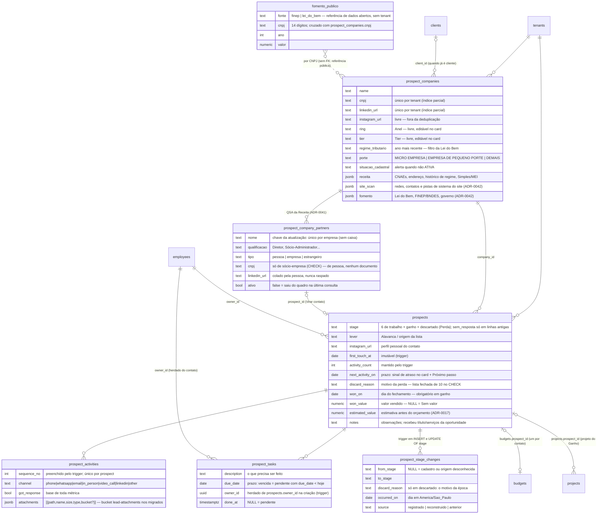
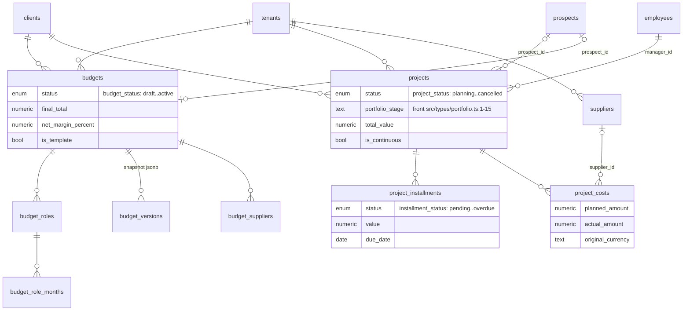
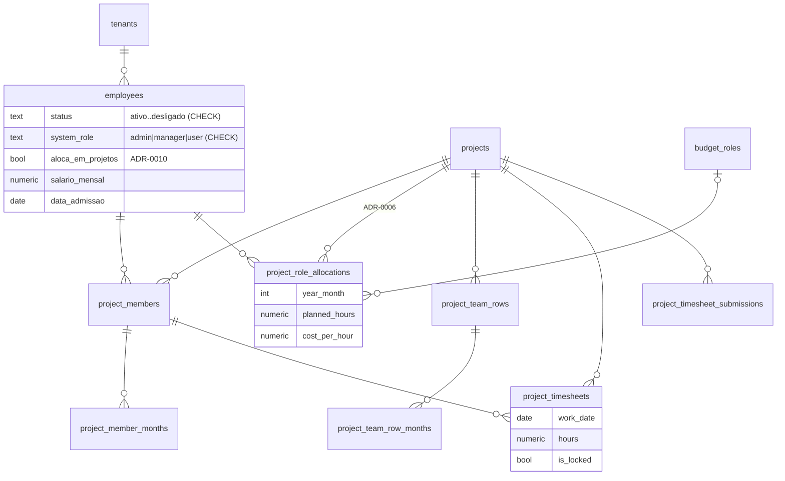
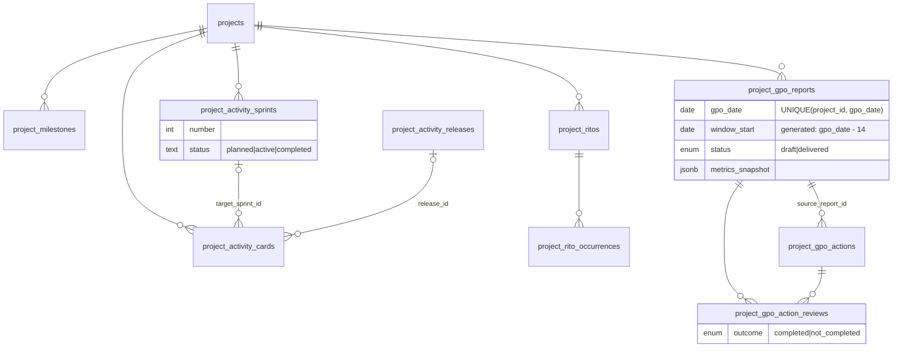
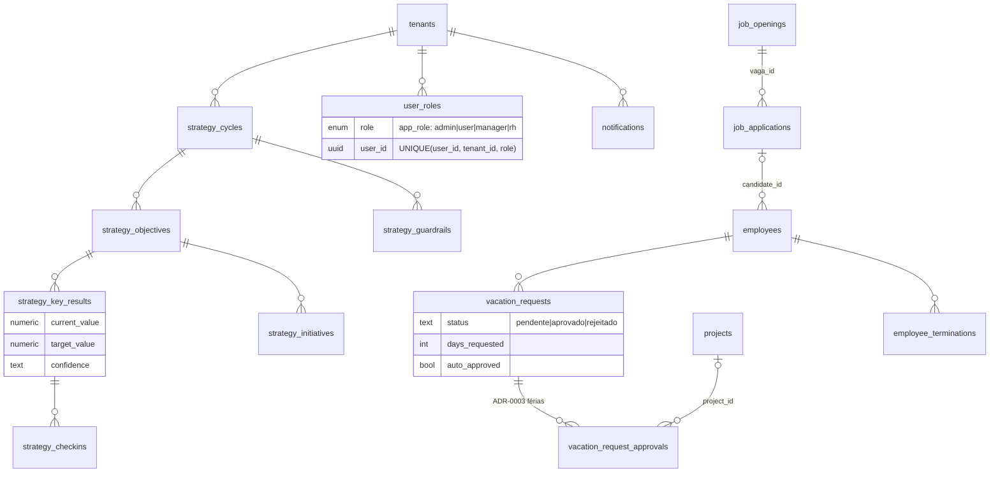

---
sources:
  - src/integrations/supabase/types.ts
  - supabase/migrations/20260121002930_945e9a92-8375-4b35-b9eb-291f57ae6716.sql
  - supabase/migrations/20260810190000_project_gpo_reports.sql
  - supabase/migrations/20260909120000_tenant_plan_and_signup_attempts.sql
  - supabase/migrations/20260909130000_tenant_plan_enforced_in_rls.sql
  - supabase/migrations/20260910100000_cost_centers.sql
  - supabase/migrations/20260910120000_cost_center_on_catalog_items.sql
  - supabase/migrations/20260915110000_prospect_companies.sql
  - supabase/migrations/20260915120000_prospects.sql
  - supabase/migrations/20260915130000_prospect_activities.sql
  - supabase/migrations/20260917115000_prospect_reuniao_feita.sql
  - supabase/migrations/20260917180000_prospect_activity_attachments.sql
  - supabase/migrations/20260917190000_prospect_lever_closed_list.sql
  - supabase/migrations/20260923120000_prospect_instagram.sql
  - supabase/migrations/20260924120000_prospect_tasks.sql
  - supabase/migrations/20260928120000_prospect_stage_changes.sql
  - supabase/migrations/20260928160000_prospect_meeting_dates.sql
  - supabase/migrations/20260928200000_prospect_ganho_perda.sql
  - supabase/migrations/20260929120000_prospeccao_absorve_oportunidades.sql
  - supabase/migrations/20260929140000_prospect_company_receita.sql
  - supabase/migrations/20260929150000_prospect_company_site_scan.sql
  - supabase/migrations/20260929160000_fomento_publico.sql
  - supabase/migrations/20261001120000_conta_azul_conexao.sql
  - supabase/migrations/20261001130000_conta_azul_sincronizacao.sql
  - src/types/receita.ts
  - src/types/prospect.ts
  - src/types/prospectMetrics.ts
  - src/types/portfolio.ts
# Conferido contra a fonte em 17/09/2026: ProspectStage = 9 valores (6 do funil +
# 3 desfechos), batendo com o CHECK de 20260917115000; prospect_activities.attachments
# confere com 20260917180000. Constantes de transicao de UI em src/types/prospect.ts
# (PROSPECT_NEXT_STAGE, PROSPECT_STAGES_BY_RESPONSE) nao afetam este diagrama.
# 23/09/2026: instagram_url em prospect_companies e prospects (20260923120000),
# fora da deduplicacao; conferido contra ProspectCompanyDB/ProspectDB.
# 24/09/2026: prospect_tasks (20260924120000), conferido contra ProspectTaskDB.
# 28/09/2026: prospect_stage_changes (20260928120000), conferido contra
# ProspectStageChangeDB e executado com backfill + trigger num Postgres local.
# 28/09/2026: 20260928160000 — reuniões anteriores ao histórico reconstruídas a partir
# da atividade da reunião; set_prospect_stage data a etapa pelo dia do fato.
# 28/09/2026: 20260928200000 — etapa ganho (won_on, won_value), Perda com a lista nova de
# motivos, regras em prospects_outcome_rules; nenhum desfecho automático (cadência esgotada
# fica em em_cadencia, sem próxima data).
# 29/09/2026 (tarde): 20260929120000 dropa leads/lead_*; Cluster 1 removido, Cluster 1b
# ganha budgets.prospect_id, projects.prospect_id, estimated_value/notes/competitor_name;
# conferido contra ProspectDB e ensaiado sobre o dump de produção (ida/volta/ida).
# 29/09/2026: 20260929140000 — retrato da Receita em prospect_companies e o quadro de sócios
# 29/09/2026: 20260929150000 (site_scan) e 20260929160000 (fomento_publico + fomento),
#  conferidos contra ProspectCompanyDB e ensaiados (ida/volta) sobre o dump atual.
# 30/09/2026: 20260930120000 remove prospects.competitor_name (e esvazia a cópia em
#  legado_oportunidades.leads, que fica com a coluna para o rollback de 20260929120000);
#  conferido contra ProspectDB.
# (reconferido após renumerar 130000→140000 e trocar só o comentário do cabeçalho;
#  tabelas, colunas e relações iguais ao diagrama)
# (prospect_company_partners), gravados pela RPC save_prospect_company_receita; conferido
# contra ProspectCompanyDB/ProspectCompanyPartnerDB e ensaiado com retrato real.
# Correção do deploy (mesmo dia): a migration desliga trg_*_keeps_admin só no trecho de
# capacidades — trigger, não coluna nem relação; o diagrama não muda.
# 29/09/2026: src/types/prospectMetrics.ts ganhou só contratos de tela (CutSafraRow no
# lugar de CutFlowRow, SafraCounts, StageRate, Reading, MetricsDrill); ProspectStageChangeDB
# inalterado, sem migration — diagrama conferido, nada muda.
# 01/10/2026: 20261001120000 — conta_azul_connections / _tokens / _oauth_states (ADR-0044),
#  conferidas contra o bloco novo do types.ts e ensaiadas (ida/volta/ida) num Postgres local.
# 01/10/2026: 20261001130000 — espelho, cache de pessoas e centros do Conta Azul, ensaiados
#  com RLS por perfil num Postgres local.
verified: 2026-10-01
---

# ERD — Entidades e Relações

> Derivado de `src/integrations/supabase/types.ts` (115 tabelas) + migrations
> mais recentes (total real ~118 tabelas). Aqui estão só as **entidades núcleo**
> (~32), agrupadas em clusters para legibilidade. FKs extraídas dos blocos
> `Relationships` do types.ts; linhas citadas são do types.ts salvo indicação.

## Multi-tenant

Isolamento por **coluna `tenant_id` + RLS** (não schema-per-tenant).
`public.tenants` e a função `user_belongs_to_tenant(_user_id, _tenant_id)`
nascem em `supabase/migrations/20260121002930_*.sql:5-10, 82-92` — o vínculo é
resolvido via `employees.auth_id = auth.uid()`. 69 tabelas têm `tenant_id`
direto; as demais são filhas que herdam o tenant pelo pai (ex.: `budget_roles`
via `budget_id`, `project_installments` via `project_id`). Nos diagramas,
`tenants` aparece só nas raízes para não virar estrela ilegível.

**Plano do tenant** (migration `20260909120000`, PUL-224): `tenants.plan` (`trial` | `active`),
`trial_ends_at`, `plan_changed_at`, `plan_changed_by`. Tenant novo nasce `trial` com 14 dias
(trigger `tenants_default_trial`); tenants anteriores à migration foram marcados `active`. As
colunas de plano só mudam por service role ou sessão direta no banco (trigger
`tenants_guard_plan_columns`); a policy de UPDATE por `configuracao:editar` vale para o resto.
O app lê `plan`/`trial_ends_at` em `AuthContext` e resolve dias restantes em `src/lib/tenantPlan.ts`.
Desde `20260909130000` (PUL-228, ADR-0028) `user_belongs_to_tenant` e `has_capability` exigem
`tenant_is_active()`: teste vencido nega toda leitura e escrita sob RLS; a leitura do próprio
`tenants` usa `user_is_member_of_tenant` (pertencimento puro) para o app mostrar o fim do teste.

## Cluster 1 — Comercial (removido em 29/09/2026)

O Pipeline de Oportunidades (`leads`, `lead_services`, `lead_interactions`,
`lead_follow_ups`, `lead_activity_log`) foi absorvido pela Prospecção e dropado pela
`20260929120000` (ADR-0040). A cópia fiel do dia fica no schema
`legado_oportunidades`, fora da API, com o de-para `lead_id → prospect_id`.

## Cluster 1b — Prospecção (quadro comercial de ponta a ponta)

Nasceu separada do Pipeline (15/09/2026) e virou o único quadro comercial: Ganho e
Perda em 28/09/2026 e, em 29/09/2026, a absorção das Oportunidades (ADR-0040). O
contato carrega valor estimado e vendido; o orçamento e o projeto apontam para ele.

```mermaid
erDiagram
    tenants ||--o{ prospect_companies : ""
    tenants ||--o{ prospects : ""
    clients |o--o{ prospect_companies : "client_id (quando já é cliente)"
    prospect_companies ||--o{ prospects : "company_id"
    prospect_companies ||--o{ prospect_company_partners : "QSA da Receita (ADR-0041)"
    prospect_company_partners |o--o| prospects : "prospect_id (Virar contato)"
    fomento_publico }o..o{ prospect_companies : "por CNPJ (sem FK: referência pública)"
    prospects ||--o{ prospect_activities : ""
    prospects ||--o{ prospect_tasks : ""
    prospects ||--o{ prospect_stage_changes : "trigger em INSERT e UPDATE OF stage"
    employees ||--o{ prospect_tasks : "owner_id (herdado do contato)"
    employees ||--o{ prospects : "owner_id"
    prospects |o--o| budgets : "budgets.prospect_id (um por contato)"
    prospects |o--o{ projects : "projects.prospect_id (projeto do Ganho)"

    prospect_companies {
        text name ""
        text cnpj "único por tenant (índice parcial)"
        text linkedin_url "único por tenant (índice parcial)"
        text instagram_url "livre — fora da deduplicação"
        text ring "Anel — livre, editável no card"
        text tier "Tier — livre, editável no card"
        text regime_tributario "ano mais recente — filtro da Lei do Bem"
        text porte "MICRO EMPRESA | EMPRESA DE PEQUENO PORTE | DEMAIS"
        text situacao_cadastral "alerta quando não ATIVA"
        jsonb receita "CNAEs, endereço, histórico de regime, Simples/MEI"
        jsonb site_scan "redes, contatos e pistas de sistema do site (ADR-0042)"
        jsonb fomento "Lei do Bem, FINEP/BNDES, governo (ADR-0042)"
    }
    fomento_publico {
        text fonte "finep | lei_do_bem — referência de dados abertos, sem tenant"
        text cnpj "14 dígitos; cruzado com prospect_companies.cnpj"
        int ano ""
        numeric valor ""
    }
    prospect_company_partners {
        text nome "chave da atualização: único por empresa (sem caixa)"
        text qualificacao "Diretor, Sócio-Administrador..."
        text tipo "pessoa | empresa | estrangeiro"
        text cnpj "só de sócio-empresa (CHECK) — de pessoa, nenhum documento"
        text linkedin_url "colado pela pessoa, nunca raspado"
        bool ativo "false = saiu do quadro na última consulta"
    }
    prospects {
        text stage "6 de trabalho + ganho + descartado (Perda); sem_resposta só em linhas antigas"
        text lever "Alavanca / origem da lista"
        text instagram_url "perfil pessoal do contato"
        date first_touch_at "imutável (trigger)"
        int activity_count "mantido pelo trigger"
        date next_activity_on "prazo: sinal de atraso no card + Próximo passo"
        text discard_reason "motivo da perda — lista fechada de 10 no CHECK"
        date won_on "dia do fechamento — obrigatório em ganho"
        numeric won_value "valor vendido — NULL = Sem valor"
        numeric estimated_value "estimativa antes do orçamento (ADR-0017)"
        text notes "observações; recebeu título/serviços da oportunidade"
    }
    prospect_activities {
        int sequence_no "preenchido pelo trigger; único por prospect"
        text channel "phone|whatsapp|email|in_person|video_call|linkedin|other"
        bool got_response "base de toda métrica"
        jsonb attachments "[{path,name,size,type,bucket?}] — bucket lead-attachments nos migrados"
    }
    prospect_stage_changes {
        text from_stage "NULL = cadastro ou origem desconhecida"
        text to_stage ""
        text discard_reason "só em descartado: o motivo da época"
        date occurred_on "dia em America/Sao_Paulo"
        text source "registrado | reconstruido | anterior"
    }
    prospect_tasks {
        text description "o que precisa ser feito"
        date due_date "prazo: vencida = pendente com due_date < hoje"
        uuid owner_id "herdado de prospects.owner_id na criação (trigger)"
        timestamptz done_at "NULL = pendente"
    }
```

Fontes: migrations `20260915110000`, `20260915120000`, `20260915130000`, `20260917115000`,
`20260917180000`, `20260917190000`, `20260923120000`, `20260924120000` e `20260928120000`.

`prospect_stage_changes` (28/09/2026) é o histórico de etapa, gravado só pelo trigger
`prospect_stage_changes_record` (SECURITY DEFINER, tenant da própria linha) — sem policy de
escrita, imutável pela API. É a única fonte da DATA de Reunião agendada, Reunião feita e
Qualificada. O backfill reconstruiu só o que tinha data real (`reconstruido`); cada contato
existente ganhou um marco `anterior` com a etapa em que estava, e as métricas tratam as
etapas até ela como alcançadas em data desconhecida (`src/lib/prospecting/milestones.ts`).

A `20260928160000` reconstruiu as reuniões desses contatos a partir da atividade que a tela
grava ao marcar Reunião feita (última com resposta em Presencial/Videoconferência; o
agendamento é a atividade anterior) e tirou o marco `anterior` deles. Desde então, mover com
`set_prospect_stage(p_prospect_id, p_stage, p_occurred_on)` (SECURITY INVOKER) data a etapa
pelo dia informado — é o que o diálogo de Reunião feita usa; o arraste comum data no dia.

Desde a `20260928200000` a Prospecção é o quadro comercial de ponta a ponta e termina em
**Ganho** (`ganho`, com `won_on` e `won_value`) ou **Perda** (`descartado`, motivo obrigatório).
As regras ficam no trigger `prospects_outcome_rules` (BEFORE UPDATE OF stage): Ganho só de
`reuniao_feita`/`qualificado`; entrar num desfecho carimba a data e fecha o card; sair limpa o
desfecho e reabre com atividade para hoje. `mark_prospect_won(p_prospect_id, p_won_on, p_value)`
(SECURITY INVOKER) registra o ganho e data o histórico pelo fechamento. **Nenhum desfecho é
automático**: a cadência esgotada (`prospect_activities_advance`) mantém o contato em
`em_cadencia`, sem próxima data, até a pessoa decidir. A etapa `sem_resposta` não recebe mais ninguém,
e `convertido` saiu do CHECK em 29/09/2026 (existe só no histórico de etapa). O único aviso de prazo da tela é o de
tarefa vencida (`prospect_tasks`); `next_activity_on` segue existindo como sugestão da
cadência, sem alerta.

`prospect_tasks` (24/09/2026) é a lista **para frente** do contato; `prospect_activities`
é o registro para trás. As duas são separadas de propósito: tarefa não conta toque, não
mexe em `activity_count`/`next_activity_on` nem move etapa — nenhum trigger de cadência
a lê. RLS decide pelo contato pai (`prospeccao:ler` / `:editar`), como nas atividades.

`prospects.stage` **tem CHECK** no banco, e a
cadência (`ARRAY[3,4,5]`) vive só na função `prospect_activities_advance` — sem
cópia em TypeScript, para não repetir TD-0022.

Etapa nova custa duas escritas no mesmo lugar: o CHECK **e** o índice parcial
`prospects_today_idx`, que lista as etapas do funil uma a uma. Esquecer o índice não
quebra nada — só tira a cobertura da consulta, em silêncio (foi o que a `20260917115000`
teve de recriar ao acrescentar `reuniao_feita`).

**`prospects_today_idx` não serve mais consulta nenhuma**: a aba "Atividades de hoje", que
filtrava `next_activity_on <= hoje AND owner_id = eu`, foi removida em 17/09/2026. O índice
segue no banco, custando escrita sem pagar leitura — derrubá-lo é uma migration pendente.
Hoje `next_activity_on` é lido só em memória: sinal de atraso no card do Kanban
(`isOverdue`) e caixa "Próximo passo" do card do contato.

Anexos vivem no bucket privado `prospect-attachments` (path `{tenant_id}/{prospect_id}/…`,
10 MB, PDF/PNG/JPG/WebP), com `prospect_activities.attachments` guardando só os metadados.
As policies de `storage.objects` decidem por **capacidade** (`prospeccao:ler` / `:editar`),
e não por `user_belongs_to_tenant` como o bucket `lead-attachments` — lá o arquivo fica mais
aberto que a linha que o referencia, divergência conhecida e ainda não corrigida.

## Cluster 2 — Orçamento → Projeto → Financeiro

```mermaid
erDiagram
    tenants ||--o{ budgets : ""
    tenants ||--o{ projects : ""
    tenants ||--o{ suppliers : ""
    clients ||--o{ budgets : ""
    clients ||--o{ projects : ""
    prospects |o--o{ projects : "prospect_id"
    prospects |o--o| budgets : "prospect_id"
    budgets ||--o{ budget_roles : ""
    budget_roles ||--o{ budget_role_months : ""
    budgets ||--o{ budget_versions : "snapshot jsonb"
    budgets ||--o{ budget_suppliers : ""
    projects ||--o{ project_installments : ""
    projects ||--o{ project_costs : ""
    suppliers |o--o{ project_costs : "supplier_id"
    employees ||--o{ projects : "manager_id"

    budgets {
        enum status "budget_status: draft..active"
        numeric final_total ""
        numeric net_margin_percent ""
        bool is_template ""
    }
    projects {
        enum status "project_status: planning..cancelled"
        text portfolio_stage "front src/types/portfolio.ts:1-15"
        numeric total_value ""
        bool is_continuous ""
    }
    project_installments {
        enum status "installment_status: pending..overdue"
        numeric value ""
        date due_date ""
    }
    project_costs {
        numeric planned_amount ""
        numeric actual_amount ""
        text original_currency ""
    }
```

Fontes: `budgets` L578, `budget_roles` L402, `budget_versions` L530,
`projects` L4582, `project_installments` L3559, `project_costs` L3357
(tabela unificada de custos — ADR-0003/0004).

Obs.: `projects.budget_id` existe como coluna, mas **não há FK declarada** nos
Relationships do types.ts (L4582).

## Cluster 3 — Alocação e Timesheet de Projeto

```mermaid
erDiagram
    tenants ||--o{ employees : ""
    projects ||--o{ project_members : ""
    employees ||--o{ project_members : ""
    project_members ||--o{ project_member_months : ""
    projects ||--o{ project_role_allocations : "ADR-0006"
    employees ||--o{ project_role_allocations : ""
    budget_roles |o--o{ project_role_allocations : ""
    projects ||--o{ project_team_rows : ""
    project_team_rows ||--o{ project_team_row_months : ""
    projects ||--o{ project_timesheets : ""
    project_members ||--o{ project_timesheets : ""
    projects ||--o{ project_timesheet_submissions : ""

    employees {
        text status "ativo..desligado (CHECK)"
        text system_role "admin|manager|user (CHECK)"
        bool aloca_em_projetos "ADR-0010"
        numeric salario_mensal ""
        date data_admissao ""
    }
    project_role_allocations {
        int year_month ""
        numeric planned_hours ""
        numeric cost_per_hour ""
    }
    project_timesheets {
        date work_date ""
        numeric hours ""
        bool is_locked ""
    }
```

Fontes: `employees` L1156 (+ `auth_id→auth.users` em
`supabase/migrations/20260121002930_*.sql:16`), `project_members` L3739,
`project_role_allocations` L4042, `project_team_rows` L4398,
`project_timesheets` L4515, `project_timesheet_submissions` L4471.

## Cluster 4 — Execução (Sprints, Kanban, GPO)

```mermaid
erDiagram
    projects ||--o{ project_milestones : ""
    projects ||--o{ project_activity_sprints : ""
    projects ||--o{ project_activity_cards : ""
    project_activity_sprints |o--o{ project_activity_cards : "target_sprint_id"
    project_activity_releases |o--o{ project_activity_cards : "release_id"
    projects ||--o{ project_ritos : ""
    project_ritos ||--o{ project_rito_occurrences : ""
    projects ||--o{ project_gpo_reports : ""
    project_gpo_reports ||--o{ project_gpo_actions : "source_report_id"
    project_gpo_reports ||--o{ project_gpo_action_reviews : ""
    project_gpo_actions ||--o{ project_gpo_action_reviews : ""

    project_activity_sprints {
        int number ""
        text status "planned|active|completed"
    }
    project_gpo_reports {
        date gpo_date "UNIQUE(project_id, gpo_date)"
        date window_start "generated: gpo_date - 14"
        enum status "draft|delivered"
        jsonb metrics_snapshot ""
    }
    project_gpo_action_reviews {
        enum outcome "completed|not_completed"
    }
```

Fontes: `project_milestones` L3797, `project_activity_sprints` L2971,
`project_activity_cards` L2667, `project_ritos` L3940; GPO em
`supabase/migrations/20260810190000_project_gpo_reports.sql:15-70`
(ciclo de vida no ADR-0017 e em `flows/` quando gerado).

## Cluster 5 — Estratégia, RH e Admin

```mermaid
erDiagram
    tenants ||--o{ strategy_cycles : ""
    strategy_cycles ||--o{ strategy_objectives : ""
    strategy_objectives ||--o{ strategy_key_results : ""
    strategy_objectives ||--o{ strategy_initiatives : ""
    strategy_key_results ||--o{ strategy_checkins : ""
    strategy_cycles ||--o{ strategy_guardrails : ""
    tenants ||--o{ user_roles : ""
    tenants ||--o{ notifications : ""
    employees ||--o{ vacation_requests : ""
    vacation_requests ||--o{ vacation_request_approvals : "ADR-0003 férias"
    projects |o--o{ vacation_request_approvals : "project_id"
    employees ||--o{ employee_terminations : ""
    job_openings ||--o{ job_applications : "vaga_id"
    job_applications |o--o{ employees : "candidate_id"

    user_roles {
        enum role "app_role: admin|user|manager|rh"
        uuid user_id "UNIQUE(user_id, tenant_id, role)"
    }
    strategy_key_results {
        numeric current_value ""
        numeric target_value ""
        text confidence ""
    }
    vacation_requests {
        text status "pendente|aprovado|rejeitado"
        int days_requested ""
        bool auto_approved ""
    }
```

Fontes: `strategy_*` L5172-L5470, `user_roles` L6452, `notifications` L2191,
`vacation_requests` L6539, `vacation_request_approvals` L6484,
`employee_terminations` L955, `job_openings` L1516, `job_applications` L1437.

## Enums nativos (types.ts L6915-6993)

| Enum | Valores |
|---|---|
| `app_role` | admin, user, manager, rh |
| `budget_status` | draft, sent, approved, rejected, expired, proposal, negotiation, active |
| `project_status` | planning, active, paused, completed, cancelled |
| `installment_status` | pending, invoiced, sent, received, overdue |
| `time_entry_type` | entrada, inicio_intervalo, fim_intervalo, saida |
| `project_rito_type` | daily, planning, review, retro, outro |
| `termination_status` | pending, in_progress, completed, cancelled, awaiting_documents |
| `project_gpo_report_status`* | draft, delivered |
| `project_gpo_action_outcome`* | completed, not_completed |

\* só em migration (`20260810190000_project_gpo_reports.sql:6,11`) — ainda fora
do types.ts.

## Módulos fora do recorte (existem, não desenhados)

Timesheet por atividade (`activity_timesheets`, `activity_types`…), ponto
eletrônico (`time_entries`, `time_daily_summary`, `time_bank_ledger`,
`time_punch_face_profiles`…), reembolsos (`reimbursement_*` — ver ADR-0007),
kanban pessoal (`personal_kanban_*`), benefícios/ferramentas, folha
(`payroll_*`), análise de mercado (`market_analyses`), tentativas de autocadastro (`signup_attempts`: só
hashes de IP e e-mail, sem policy, lida e escrita apenas pela service role em
`register-tenant`), centros de custo (`cost_centers`, PUL-217: cadastro-base do tenant,
`tenant_id` → `tenants`, nome único por tenant, leitura por membro e escrita por
`configuracao:editar`, sem DELETE). Desde PUL-221 (ADR-0031) o **item aponta para o centro**:
`services.cost_center_id` e `activity_types.cost_center_id` (FK `RESTRICT`, anuláveis por
expand-contract — a obrigatoriedade está no cadastro), e a hora guarda o centro **do momento
do lançamento** em `activity_timesheets.cost_center_id`, preenchido pelo trigger
`activity_timesheets_set_cost_center` a partir do item quando quem insere não informa. Trocar
o centro de um item não reescreve as horas já lançadas. Pessoa × centro chega em PUL-218. Gerar diagrama dedicado sob demanda.

Integração Conta Azul (ADR-0044, `20261001120000`): `conta_azul_connections` (uma por tenant —
`tenant_id` UNIQUE → `tenants`; `ca_company_id` UNIQUE no Pulse inteiro; lida sob RLS por
`integracoes:gerir` ou `conciliacao:*`, escrita só por service role), `conta_azul_tokens`
(1:1 com a conexão, `ON DELETE CASCADE`, token cifrado, **sem policy**) e
`conta_azul_oauth_states` (`tenant_id` → `tenants`, uso único, **sem policy**). A RPC
`conta_azul_claim_refresh` (só `service_role`) serializa a renovação do token. Parte 2
(`20261001130000`): `conta_azul_installments` (espelho de parcelas, UNIQUE
`(connection_id, ca_installment_id)`, RLS por `kind`: receita com `conciliacao:receber`, despesa
com `conciliacao:pagar`), `conta_azul_people` (cache de CNPJ, sem policy) e
`conta_azul_cost_centers` (`cost_center_id` → `cost_centers`, `ON DELETE SET NULL`, UPDATE só
dessa coluna por `integracoes:gerir`).

## Divergências código × doc

1. **`src/integrations/supabase/types.ts` está desatualizado** em relação às
   migrations: não contém `project_gpo_reports`/`project_gpo_actions`/
   `project_gpo_action_reviews` (`20260810190000_*.sql`) nem
   `service_avg_tickets` (`20260806140000_*.sql`), e ainda lista a legada
   `service_line_avg_tickets` (L4928). Em 09/09 as colunas de plano de `tenants` foram
   acrescentadas ao types.ts à mão (PUL-224); `signup_attempts` ficou fora de propósito, o
   app não a lê. **Ação sugerida:** regenerar os types (`supabase gen types`).
2. **Glossário × código:** o glossário ainda define "Lead" e "CRM" como termos
   correntes, enquanto boundaries.md exige Oportunidade/Pipeline na UI. No
   banco, `leads`/`crm_stage` deixaram de existir em 29/09/2026 (ADR-0040); o
   glossário foi atualizado junto.
3. **Reembolsos:** ADR-0007 remove o módulo, mas as tabelas `reimbursement_*`
   seguem no schema (types.ts L4786). Confirmar se é legado a limpar ou
   mantido por histórico.
4. `projects.budget_id` sem FK declarada (types.ts L4582) — integridade só por
   convenção.
