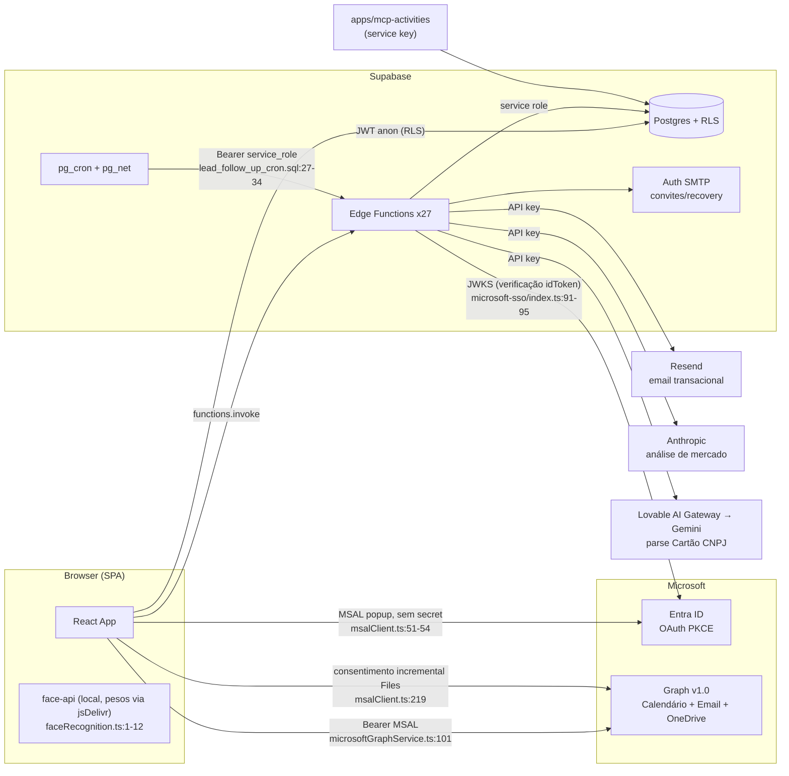

---
sources:
  - supabase/functions/**
  - supabase/config.toml
  - src/services/microsoftGraphService.ts
  - src/integrations/microsoft/msalClient.ts
  - src/integrations/microsoft/config.ts
  - src/lib/faceRecognition.ts
  - supabase/migrations/20260622130000_installment_nf_alert_cron.sql
  - supabase/migrations/20260717120000_time_tracking_reminders_cron.sql
  - supabase/migrations/20260810150000_lead_follow_up_reminder_cron.sql
  - apps/mcp-activities/src/index.ts
---

# Mapa de Integrações

> Derivado do código em 2026-08-11. Quem chama quem, com que credencial.

## Visão geral

## Serviços externos

| Serviço | Consumidor | O quê | Credencial |
|---|---|---|---|
| Microsoft Entra ID | Browser (`msalClient.ts:54`) | Login OAuth Auth Code + PKCE | client_id público, sem secret (`config.ts:1-16`) |
| Microsoft Graph v1.0 | Browser (`microsoftGraphService.ts:39`) | Calendário (`/me/calendarView`, `/me/events`) e Email (`/me/mailFolders/inbox/messages`); escopos `Calendars.ReadWrite`, `Mail.Read` (`:47`) | Bearer MSAL, renovado silent; backend nunca vê o token |
| Microsoft Graph — OneDrive | Browser (`microsoftGraphService.ts:962-1075`) | Seletor de pasta raiz do projeto: `/me/drive/root`, `/drives/{id}/items/{id}/children`, `/me/drive/sharedWithMe` e `/shares/u!{b64}/driveItem`. Escopo `Files.ReadWrite.All` **em conjunto separado** (`FILES_SCOPES`, `:962`) | Bearer MSAL adquirido por consentimento incremental (`msalClient.ts:219`), só ao abrir o seletor |
| Resend | `send-invite-email/index.ts:135`, `send-candidate-hired-email/index.ts:126` | Email transacional (ver divergência 2) | `RESEND_API_KEY` |
| Anthropic | `market-analysis-start/index.ts:317` (Opus 4), `market-analysis-refine/index.ts:37` (Sonnet 4) | Relatórios de análise de mercado | `ANTHROPIC_API_KEY` |
| Lovable AI Gateway (Gemini 2.5 Flash) | `parse-cnpj-card/index.ts:35-42` | Extração estruturada de Cartão CNPJ (PDF); usado por `ClientForm` e `SupplierFormDialog` | `LOVABLE_API_KEY` |
| Reconhecimento facial | `src/lib/faceRecognition.ts:1-12` | **100% local no browser** (`@vladmandic/face-api`), threshold 0.6; só os pesos vêm da CDN jsDelivr | — |
| SMTP do Supabase Auth | `create-employee-user`, `resend-employee-invite`, `request-first-access` | Convites e recovery links (substituiu Resend nessas funções) | interno Supabase |

## Edge Functions por grupo

**SSO** — `microsoft-sso`: valida idToken via JWKS + `tid` e emite magiclink
`tokenHash` (`index.ts:91-111, 152-161`). `verify_jwt=false`
(`config.toml:5-7`). Ver ADR-0016 e sequência no `overview.md`.

**RH / convites** — `create-employee-user` (convite via `inviteUserByEmail`,
valida JWT manualmente — `index.ts:108, 263-267`), `resend-employee-invite`
(exige admin — `index.ts:91`), `request-first-access` (público),
`register-tenant`, `recalculate-employee-costs`, `send-candidate-hired-email`,
`send-invite-email`.

**Ponto / facial** — `record-time-punch` (recebe `face_match_status` calculado
**no cliente** — `index.ts:330-349`), `enroll-face-profile` (descriptor de 128
floats), `delete-face-profile`, `submit-time-adjustment`,
`decide-time-adjustment`, `register-absence-period`.

**Notificações in-app** (gravam em `notifications`, sem serviço externo):

| Função | Agendamento (pg_cron → pg_net) |
|---|---|
| `notify-time-tracking-reminders` | `0 9 * * *` — `20260717120000_*.sql:21-34` |
| `notify-installment-alerts` | `0 8 * * *` — `20260622130000_*.sql:22-35` |
| `notify-lead-follow-ups` | `0 8 * * *` — `20260810150000_*.sql:23-36` |
| `notify-timesheet-reminder`, `notify-timesheet-pending`, `timesheet-alert-managers`, `timesheet-reminder-employees` | **sem cron no repo e sem chamador** (ver divergência 3) |

Crons só-SQL (sem edge function): ativação de versões de employee `0 3 * * *`
(`20260721150000_*.sql:85-88`); recálculo trimestral de ticket médio
(`20260806130000_*.sql:193-197`, `20260806140000_*.sql:194-198`).

**Análise de mercado** — `market-analysis-start` / `-refine` / `-status`
(jobs em `market_analysis_jobs`).

**Seed** — `seed-admin` (protegido por `SEED_SECRET_TOKEN` — `index.ts:17`),
`seed-demo-tenant` (ver ponto de atenção 1).

**MCP** — `apps/mcp-activities` é um servidor MCP de saída que lê o Supabase
com `SUPABASE_SERVICE_KEY` (`src/index.ts:19-20`), para uso via Claude.

## Variáveis de ambiente

Não existe `.env.example` (vale criar). Frontend: `VITE_SUPABASE_PROJECT_ID`,
`VITE_SUPABASE_URL`, `VITE_SUPABASE_PUBLISHABLE_KEY`,
`VITE_MICROSOFT_CLIENT_ID`, `VITE_MICROSOFT_TENANT_ID` — os dois últimos com
fallback hardcoded (`src/integrations/microsoft/config.ts:19-25`).

Edge Functions: `SUPABASE_URL`, `SUPABASE_ANON_KEY`,
`SUPABASE_SERVICE_ROLE_KEY`, `MICROSOFT_CLIENT_ID`, `MICROSOFT_TENANT_ID`,
`ANTHROPIC_API_KEY`, `LOVABLE_API_KEY`, `RESEND_API_KEY`, `RESEND_FROM_EMAIL`,
`SEED_*`. pg_cron usa os settings `app.supabase_url` e `app.service_role_key`
(`20260622130000_*.sql:27-31`).

## Pontos de atenção (código, preexistentes — candidatos a TD/correção)

1. **`seed-demo-tenant` é endpoint aberto**: `verify_jwt=false`
   (`config.toml:43`), sem verificação de token/header no código, e com
   credenciais demo hardcoded (`index.ts:21-25`).
2. **`register-tenant` e `recalculate-employee-costs`** também têm
   `verify_jwt=false` sem checagem de chamador no corpo.
3. **`market-analysis-start` confia em `userId`/`tenantId` do body** sem
   validar sessão (`index.ts:274-282`) — quebra o modelo de autorização por
   recurso.
4. **Verificação facial é client-side**: `record-time-punch` aceita
   `face_match_status`/`score` calculados no navegador (`index.ts:330-349`) —
   o servidor não re-verifica.
5. **`FILES_SCOPES` não pode ser fundido em `GRAPH_SCOPES`**
   (`microsoftGraphService.ts:962` vs `:47`). `GRAPH_SCOPES` é usado em toda
   aquisição de token, inclusive as silenciosas de agenda; somar o escopo de
   arquivos ali faria agenda e e-mail exigirem o consentimento de admin de
   `Files.ReadWrite.All` e quebrarem num tenant sem ele. Ver
   `.harness/integrations/onedrive.md`.

## Divergências código × doc

1. **Nomenclatura**: função e cron `notify-lead-follow-ups` usam "lead";
   boundaries exige Oportunidade/Pipeline na UI (backend segue histórico).
2. **Resend meio-desligado**: `resend-employee-invite` e
   `request-first-access` declaram "não usa mais Resend" (`index.ts:7` de
   cada), mas `send-invite-email` (sem nenhum chamador no repo — provável
   legada) e `send-candidate-hired-email` ainda dependem dele.
3. **4 funções de lembrete de timesheet órfãs** (sem cron no repo e sem
   chamador): ou o agendamento vive só no painel do Supabase (documentar), ou
   são código morto.
