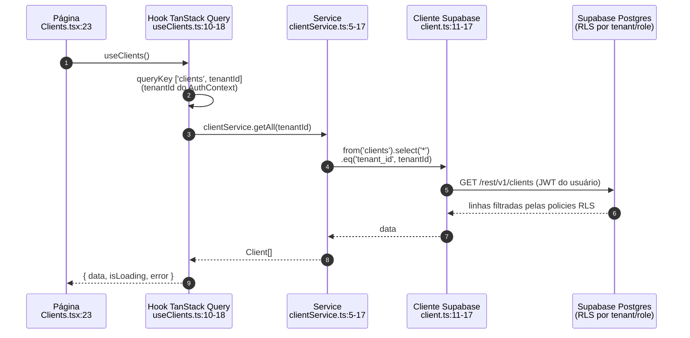
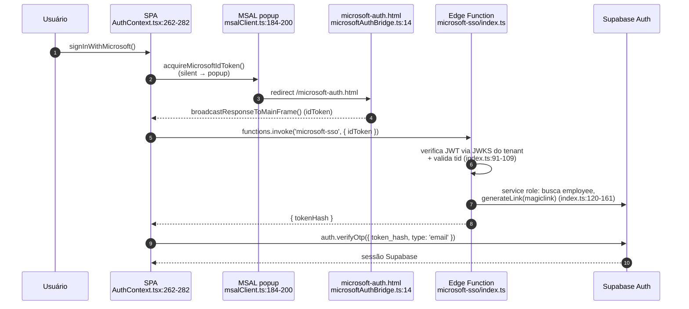

---
sources:
  - src/main.tsx
  - src/App.tsx
  - src/contexts/AuthContext.tsx
  - src/integrations/supabase/client.ts
  - src/integrations/microsoft/msalClient.ts
  - src/microsoftAuthBridge.ts
  - src/sw.ts
  - src/lib/pwa.ts
  - src/components/auth/ProtectedRoute.tsx
  - src/components/auth/RoleProtectedRoute.tsx
  - src/hooks/useClients.ts
  - src/services/clientService.ts
  - supabase/functions/microsoft-sso/index.ts
  - vite.config.ts
  - package.json
  - index.html
  - app.html
  - vercel.json
  - src/components/auth/RootEntry.tsx
  - src/pages/LandingPage.tsx
  - src/landing/content.ts
  - src/landing/prerender-entry.tsx
  - scripts/prerender-landing.mjs
---

# Arquitetura — Visão Geral

> Doc derivada do código em 2026-08-11. Regenerar quando as fontes do
> frontmatter mudarem (drift-check do Stop, ADR-037).

## Stack

- **Frontend:** React 18 + Vite + TypeScript, React Router, TanStack Query,
  Tailwind CSS, shadcn/ui (Radix). Origem Lovable (`package.json`).
- **Backend:** Supabase — Postgres com RLS, Auth, Edge Functions (Deno).
  Cliente único criado em `src/integrations/supabase/client.ts:11-17`
  (`VITE_SUPABASE_URL` / `VITE_SUPABASE_PUBLISHABLE_KEY`, sessão persistida
  em localStorage com auto-refresh).
- **Observabilidade de produto:** Amplitude + Session Replay, inicializado
  antes do render (`src/main.tsx:11-12`).
- **PWA:** service worker próprio (`injectManifest`, `vite.config.ts:23-46`),
  registrado **somente em viewport mobile** (`src/main.tsx:7-9`).

## Composição da aplicação (bootstrap)

Ordem dos providers em `src/App.tsx:104-114`, de fora para dentro:

```
QueryClientProvider (staleTime 2min, App.tsx:78-80)
└─ ThemeProvider (default light)
   └─ AuthProvider            ← fora do Router
      └─ TooltipProvider + Toaster/Sonner
         └─ BrowserRouter
            └─ OnboardingProvider
               └─ InstallPwaBanner + PwaRouteGuard
                  └─ <Routes> (App.tsx:109-462)
```

## Módulos e rotas

Dois guards de rota: `ProtectedRoute` (`src/components/auth/ProtectedRoute.tsx`; desde 09/09 também manda e-mail não confirmado para `/confirme-seu-email` e teste expirado para `/teste-encerrado`, ver ADR-0028)
e `RoleProtectedRoute` com flags `requireManager` / `requireAdmin` / `requireRH`
(`src/components/auth/RoleProtectedRoute.tsx:13`).

| Módulo | Rotas principais | Guard | Fonte (App.tsx) |
|---|---|---|---|
| Público | `/` (landing, para quem não tem sessão), `/login`, `/esqueci-minha-senha`, `/reset-password`, `/trabalhe-conosco/:tenantId`; `/landing` redireciona para `/`; `/register` é o autocadastro (PUL-227); `/boas-vindas` e `/confirme-seu-email` confirmam o e-mail; `/teste-encerrado` recebe tenant com teste vencido | — | 110-123, 455-456 |
| Home | `/` → RootEntry (`src/components/auth/RootEntry.tsx:25-37`): sem sessão → `LandingPage` (a mesma já pré-renderizada no HTML); com sessão → HomeRedirect (admin → `/admin-dashboard`, demais → `/dashboard`) | — (decide pela sessão) | 140 |
| Pessoal | `/inbox`, `/minha-agenda`, `/meus-emails`, `/my-timesheet`, `/minhas-ferias`, `/my-kanban`, `/my-projects` | Protected | 153-158, 167, 450-452 |
| Jornada (ponto) | `/jornada`, `/jornada/configuracoes`, `/jornada/aprovacoes`, `/jornada/relatorios`, `/jornada/auditoria` | Protected / Admin / RH | 176, 184, 192, 200, 208 |
| GPO | `/gpo`, `/gpo/:id`, `/gpo/:id/apresentar` | Manager | sem rota `path` correspondente no App.tsx atual (busca por "gpo": —); ver Divergências |
| Pessoas / RH | `/employees*`, `/rh/desligamentos`, `/rh/candidatos`, `/rh/vagas`, `/rh/ferias`, `/rh/ferramentas-beneficios` | Manager (benefícios: Admin) | 217, 225, 233, 435, 443, 453-454, 458-459 |
| Clientes / Fornecedores | `/clients*`, `/suppliers` | Manager | 241, 249, 257, 265, 273 |
| Projetos | `/projetos` (Portfolio), `/projects/:id` | Manager / **apenas Protected** | 282, 290, 307, 315, 323 |
| Análises | `/analises/meu-time`, `/analises/alocacoes*`, `/analises/financeiro`, `/analises/comercial`, `/analises/folha-pagamento`, `/analises/custo-hora` | Manager (folha e custo-hora: Admin) | 299, 331, 339, 347, 355, 395-397 |
| Pipeline Comercial | `/pipeline`, `/comercial/servicos*`, `/comercial/ticket-medio`, `/budgets/:id*` | Manager | 364, 372-375, 383, 403, 411, 419 |
| Estratégia | `/estrategia` | Manager | 457 |
| Admin | `/admin`, `/admin-dashboard` | Admin | 143, 427 |

Redirects de compatibilidade (`App.tsx:391-393, 399`): `/crm`→`/pipeline`,
`/portfolio`→`/projetos`, `/analytics`→`/analises/financeiro`,
`/budgets`→`/pipeline`, entre outros.

**Guard PWA:** em modo standalone só `/my-timesheet` e `/my-kanban` são
permitidas; o resto redireciona para `/my-timesheet`
(`src/lib/pwa.ts:1,16`, `src/components/pwa/PwaRouteGuard.tsx:10-16`).

## Entradas HTML e build (vitrine × app)

Três entradas HTML em `vite.config.ts` (`build.rollupOptions.input`):

| Entrada | Papel | Indexável | Quem serve |
|---|---|---|---|
| `index.html` | Home pública (landing). No build, `scripts/prerender-landing.mjs` roda depois do `vite build` (`package.json` → `build`), compila `src/landing/prerender-entry.tsx` em modo `prerender` (sem PWA nem tagger) e injeta `<head>` e corpo gerados de `src/landing/content.ts`; gera `sitemap.xml` e `llms.txt` e valida o JSON-LD, falhando o build se faltar algo | sim | Vercel, pelo filesystem (`/`) |
| `app.html` | Shell da área logada, `<meta name="robots" content="noindex, nofollow">` | não | Vercel: `vercel.json` reescreve toda rota que não é arquivo para `/app.html` |

`vercel.json` também redireciona (308, permanente) qualquer caminho pedido pelo host `og-pulse.vercel.app` para `https://origamipulse.com.br`, porque esse host servia a home inteira sem `noindex` (PUL-231). A escolha apex × `www` é configuração de domínio no painel da Vercel, não do repositório.
| `microsoft-auth.html` | Retorno do OAuth Microsoft (ver SSO) | não | filesystem |

`src/landing/content.ts` é a fonte única de copy, SEO, JSON-LD, `llms.txt` e
`sitemap.xml` da vitrine (`PUBLIC_ROUTES` lista só a home). Scripts de operação:
`npm run prerender`, `npm run og:image` (imagem social via Playwright) e
`npm run gsc:*` (Search Console pela API, `scripts/search-console.mjs`, credencial
fora do repositório). Decisões e tarefas: PUL-223, PUL-230 a PUL-241.

## Fluxo de um request (leitura de dados)

Fluxo canônico — exemplo real da tela de Clientes:



Mutations seguem o mesmo caminho e invalidam a queryKey no `onSuccess`
(ex.: `src/hooks/useProjectGpo.ts:50-62`, que também emite toast).

**Escala real:** 69 páginas, 122 hooks, 37 services, 27 Edge Functions.

## Autenticação

- `AuthProvider` (`src/contexts/AuthContext.tsx:53-64`) expõe `user`,
  `session`, `employee`, papéis derivados de `user_roles` (`admin` implica
  `manager` e `rh` — `AuthContext.tsx:90-138`).
- Bootstrap: `onAuthStateChange` registrado **antes** de `getSession()`
  (`AuthContext.tsx:162-206`); sessão sem funcionário ativo é derrubada com
  `accessDenied` (`AuthContext.tsx:152-160`).
- Troca de senha usa a RPC `complete_password_change` (SECURITY DEFINER),
  pois UPDATE direto é bloqueado pelo trigger
  `prevent_employee_self_escalation` (`AuthContext.tsx:310-346`).
- Offline (PWA): snapshot do employee em localStorage com TTL 24h
  (`AuthContext.tsx:20-35`).

### Microsoft SSO (ADR-0016)



O `msalClient` serve dois tipos de token, com finalidades que não se misturam:
**ID token** (`acquireMicrosoftIdToken:184`), prova de identidade que só a Edge
Function valida, e **access token do Graph**
(`acquireGraphTokenForScopes:219`), usado para chamar a API. O segundo aceita o
conjunto de escopos por parâmetro para permitir consentimento incremental — o
seletor de pasta do OneDrive pede `Files.ReadWrite.All` sem contaminar as
aquisições de agenda e e-mail. Ver `.harness/integrations/onedrive.md`.

## PWA / Service worker (`src/sw.ts`)

- Cacheia **apenas GETs** ao REST do Supabase de uma allowlist de 15 tabelas
  (`sw.ts:11-16, 56-59`), estratégia NetworkFirst com timeout 4s, expiração
  24h / 250 entradas (`sw.ts:60-64`).
- Isolamento por sessão: chave de cache carrega hash SHA-256 do `sub` do JWT;
  resposta sem fingerprint válido não é gravada (`sw.ts:29-54`).
- Logout envia `CLEAR_PRIVATE_CACHES` e apaga o cache privado
  (`sw.ts:67-69`, `AuthContext.tsx:300-308`).

## Divergências código × doc

1. **Camada de service não é obrigatória na prática.** O fluxo canônico é
   página → hook → service → supabase, mas hoje **73 dos 122 hooks importam o
   cliente Supabase diretamente** (47 passam por `src/services/`), e 12 páginas
   + 21 componentes acessam `@/integrations/supabase/client` sem hook/service.
   Não há ADR ou pattern que exija a camada — se o time quiser torná-la regra,
   cabe ADR + pattern; senão, esta doc registra o estado real.
2. **`/projects/:id` usa apenas `ProtectedRoute`** (`App.tsx:294-301`),
   enquanto `/projetos` (Portfolio) exige `requireManager`. Coerente com
   ADR-0002 (acesso de recurso/PM ao próprio projeto), mas vale confirmar que
   a autorização fina acontece via RLS, não via rota.

8. Módulo(s) da tabela de rotas sem `path` correspondente no `App.tsx` atual: GPO (regeneração de 2026-09-09). Confirmar se a rota foi removida ou renomeada e ajustar a tabela.
